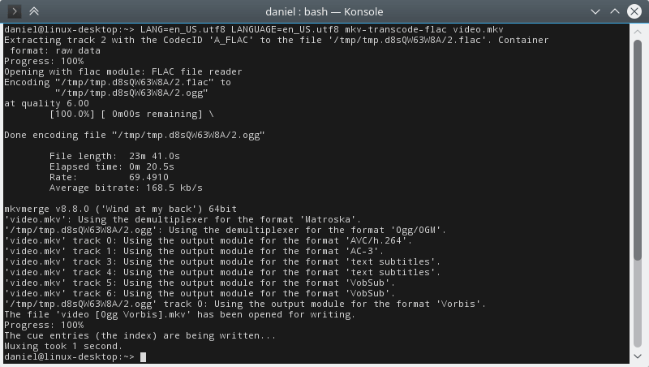
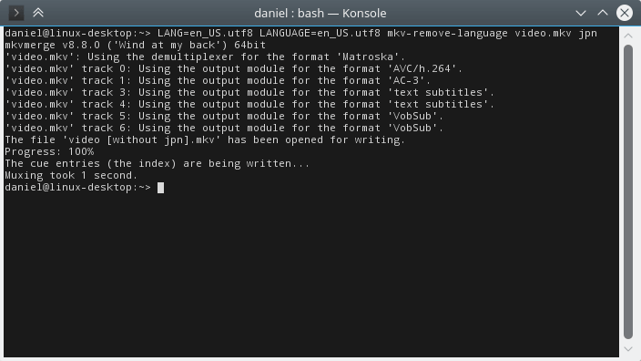
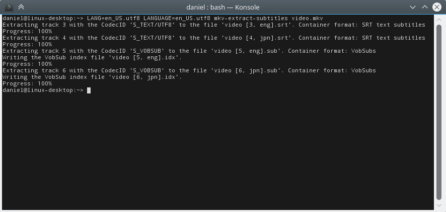

# mkv-bash-tools

## Warning: These scripts are outdated and won't work with current versions of mkvmerge

I'm keeping them here because I might update them at some point - but no promises.

## mkv-transcode-flac

A BASH script that transcodes all FLAC tracks of a matroska file to Ogg Vorbis while preserving the track's name and language and it's default and forced flags as well as its delay.

### Depends on

mktemp  
mkvmerge  
mkvextract  
oggenc (with FLAC decoder enabled)

### Usage

`chmod +x mkv-transcode-flac`  
`./mkv-transcode-flac "My File.mkv"`  
This will create a new file called "My File [Ogg Vorbis].mkv".

For batch converting all .mkv files in the current directoy copy mkv-transcode-flac to a directory in your PATH and execute:  
`find -iname "*.mkv" -exec mkv-transcode-flac '{}' \;`

## mkv-transcode-dts

A BASH script that transcodes all DTS-HD Master Audio tracks of a matroska file to DTS Core while preserving the track's name and language and it's default and forced flags as well as its delay.

### Depends on

mktemp  
mkvmerge  
mkvextract  
ffmpeg (version 3.1 or higher)

### Usage

`chmod +x mkv-transcode-dts`  
`./mkv-transcode-dts "My File.mkv"`  
This will create a new file called "My File [DTS Core].mkv".

For batch converting all .mkv files in the current directoy copy mkv-transcode-dts to a directory in your PATH and execute:  
`find -iname "*.mkv" -exec mkv-transcode-dts '{}' \;`

## mkv-remove-language

A BASH script that removes the audio track with the specified language from a matroska file.

### Depends on

mkvmerge  

### Usage

`chmod +x mkv-remove-language`  
`./mkv-remove-language "My File.mkv" "eng"`  
This will create a new file called "My File [without eng].mkv".

For batch processing all .mkv files in the current directoy copy mkv-remove-language to a directory in your PATH and execute:  
`find -iname "*.mkv" -exec mkv-remove-language '{}' "lang" \;`

## mkv-extract-subtitles

A BASH script that extracts subtitles from a matroska file.

### Depends on

mkvmerge  
mkvextract  

### Usage

`chmod +x mkv-extract-subtitles`  
`./mkv-extract-subtitles "My File.mkv"`  
This will create a new file for each subtitle in the current directory.

For batch processing all .mkv files in the current directoy copy mkv-extract-subtitles to a directory in your PATH and execute:  
`find -iname "*.mkv" -exec mkv-extract-subtitles '{}'\;`
